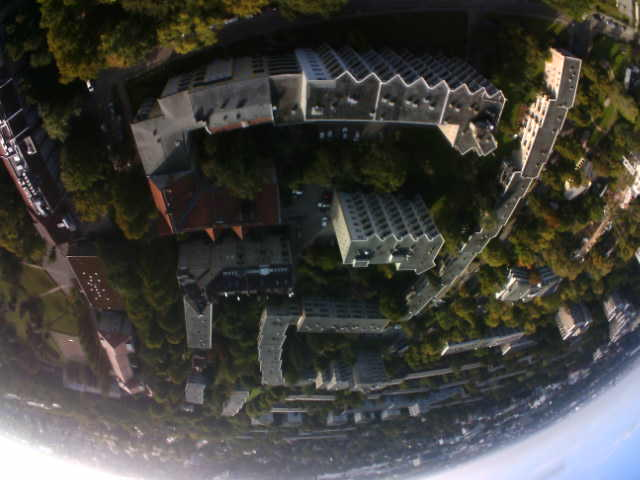
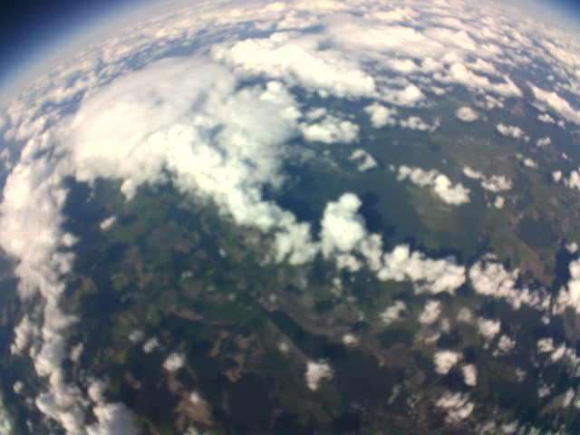
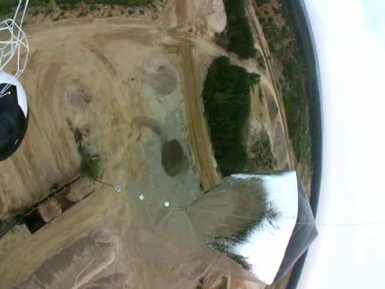

# Pecan Pico 10 - A lightweight APRS tracker and digipeater
This project contains the Pecan Pico project in it's 10th version. A Pecan is a cheap lightweight APRS position tracker designed especially for small ballons which may fly for months. This tracker has been made in respect of weight, functionality and price because it's usually used once like a satellite. While the balloon can fly for a long time, this tracker is solar powered and recharges it's battery at daytime and uses the power stored in the battery at night.
Since this version, the tracker is also able to receive APRS (AFSK and FSK). Therefore it's able to operate as solar enabled digipeater.

The main features are:
- GPS Tracking
- Taking pictures
- APRS receiption and transmission
- Measuring Temperature/Airpressure/Humidity (up to 3 separate sensors)
- Digipeating

__Powering:__ The Pecan Pico 10 can be powered either by USB or by a single LiPO cell which are charged with solar cells. In power safe mode, it uses 50mW and around 150-200mW in normal operation.

__Storage:__ There can be stored up to 14,560 data points (GPS & telemetry) without any external memory devices. For additional storage and picture logging, a Micro SD card can be inserted into the device.

__Transceiver:__ Though the software is mainly optimized for APRS operation, it can be also used for 2/4FSK (RTTY) and OOK (CW) operation. The maximum transmission power is 100mW. The fastest tested FSK speed is 115k2.

__Image transmission:__ The software makes use of the JPEG compression of the Omnivision OV5640. Although the connector is suitable for some other cameras too, the OV5640 is the only camera which can be used due to the missing HREF pin. The protocol being used for the images transmission is APRS/SSDV. This protocol is fully APRS compatible but needs extra software to be decoded again. Though the camera can do pictures up to 5MP, there is only enough memory available to take XGA pictures (1024x768px).

__Telemetry transmission:__ Since APRS does only allow a ceirtain amount of telemetry fields being transmitted, the complete telemetry is sent as a binary format along with the position transmissions in the comment field. The APRS packet stays completly compatible with the existing network. The additional telemetry can be decoded with an additional software.

__Sensors:__ The Pecan uses a single chip (BME280) to measure the temperature, airpressure and humidity. There can be attached up to two additional BME280's for various purposes.

__Additional sensors:__ The Pecan provides an external I2C bus from where addional sensors can be accessed. There is also a signle GPIO pin, which can be used for varios stuff.

__GNSS (GPS):__ The ublox EVA-7M chip can receive GPS which is used to determine the region specific APRS frequency. Since the GPS draws a lot of power, it can be switched on and off as needed. The device is also compatible with the ublox EVA-M8.

__Debugging/Configuration:__ The device can be accessed over USB in order to configure it or get debug messages out of the device. The log memory can also be accessed over USB.

# Transmitted test pictures

 
*Closed Airport Berlin Tempelhof roughly 3km altitude*

 
*Picture at low altitude right away after the launch*

 
*Clouds somewhere in Germany at an altitude of 12km*

 
*Lakes in East Poland (Myślibórz) at 8km altitude, antenna and radar reflector in the picture*

 
*South East Berlin (Adlershof/Grünau) taken at roughly 5km altitude*

 
*Launch with solar heated balloons (a cooperation with [Aerocene](http://www.aerocene.org))*

Contributions
=============

Please let me know if you have questions or ideas: sven.steudte@gmail.com

